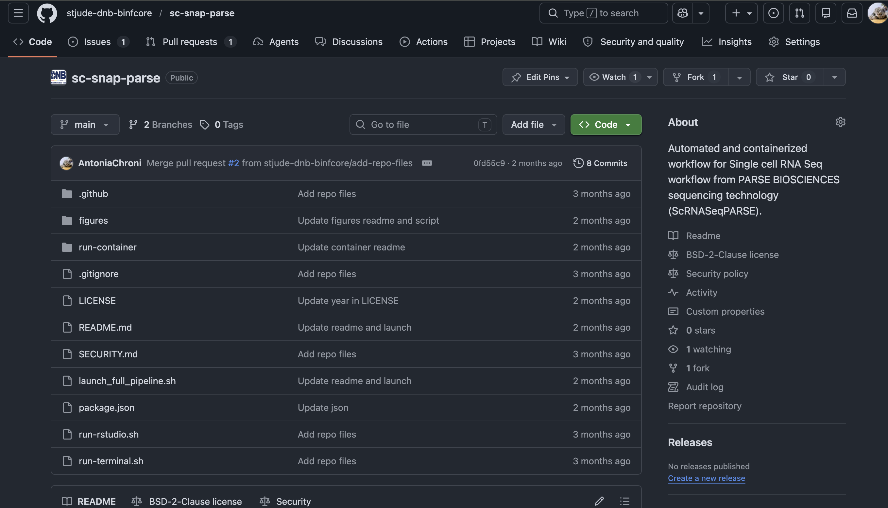
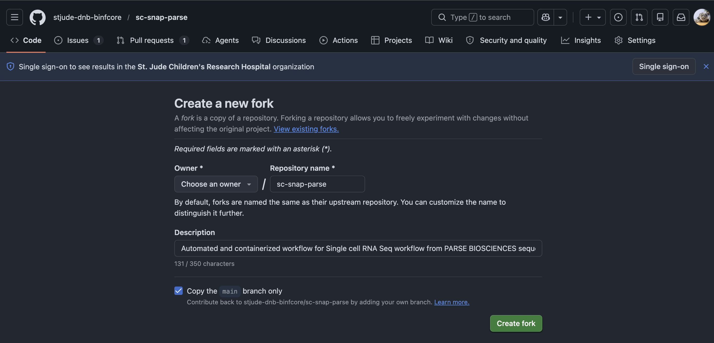
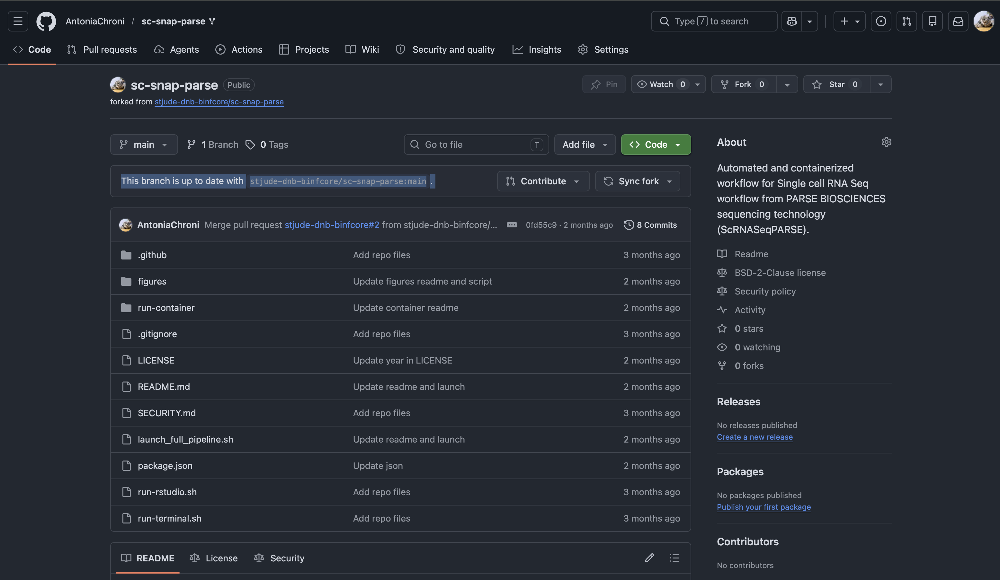

<p align="center";">
  
</p>
<p align="center";">
  <a href="https://www.repostatus.org/#active">
    
  </a>
  <a href="https://github.com/stjude-dnb-binfcore/sc-snap-parse">
    
  </a>
</p>

#  Single-cell RNA-seq data workflow from PARSE BIOSCIENCES sequencing technology (ScRNASeqPARSE)

Snap-Parse is a comprehensive suite of tools and workflows for analyzing single-cell RNA-seq data from [PARSE BIOSCIENCES](https://support.parsebiosciences.com/hc/en-us) sequencing technology (ScRNASeqPARSE) supporting **mouse genome** cohorts. Snap-Parse is an initiative of the [Bioinformatics Core](https://www.stjude.org/research/departments/developmental-neurobiology/shared-resources/bioinformatic-core.html) at the Department of Developmental Neurobiology at the St. Jude Children's Research Hospital.


## Table of Contents

1. [Getting Started](#getting-started)
2. [Installation](#installation)
3. [Tutorial and Documentation](#tutorial-and-documentation)
4. [Preparing project metadata](#preparing-project-metadata)
5. [How to Use the Repository](#how-to-use-the-repository)
   - [Accessing the Code](#accessing-the-code)
   - [Running the Code](#running-the-code)
6. [Requesting CPU and Memory Resources](#requesting-cpu-and-memory-resources)
7. [Launch the Full Pipeline](#launch-the-full-pipeline)


## Getting Started

### Installation

To begin using the Snap-Parse pipeline, follow the instructions below to set up the environment and run the code. A pre-built [Docker image](https://github.com/stjude-dnb-binfcore/sc-snap-parse/blob/main/run-container/README.md) is available for easy setup, containing all the necessary tools, packages, and dependencies to seamlessly run the code and analysis modules. 

### Tutorial and Documentation

For a step-by-step guide on how to access the code, run the analysis, and request memory from the HPCF cluster, refer to the current README file or the [Snap-Parse wiki page](https://github.com/stjude-dnb-binfcore/sc-snap-parse/wiki). Training sessions can also be provided upon request for St. Jude users.


### Preparing project metadata

Project metadata drives which sublibraries and samples are processed, where FASTQ files live, and other metadata related to the project. Before running any analysis module, prepare the metadata files it references.

#### 1. Metadata file format (all modules)

Metadata files are **tab-separated (TSV)**. Each row is one sample or sublibrary. The `ID` or `sublibrary_ID` columns for any metadata file must contain **unique** values.

#### 2. Module-specific metadata requirements

For example metadata files, see `./data/project_metadata/`. Additional columns not listed below are optional unless a module requires them.

**`fastqc-analysis`** — file set by `sublibrary_metadata.tsv`

- Required columns: `ID`, `FASTQ`
- `FASTQ` should point to directories containing `*R1*.fastq.gz` files.
- For technical replicates, list comma-separated paths in the same row.
- For an example metadata, see `./data/project_metadata/sublibrary_metadata.tsv`. 

**`parseq-alignment`** — file set by `sublibrary_metadata.tsv` and `sample_loading_table.xlsm`

- Required columns: `sublibrary_ID`, `FASTQ`, `kit`, `chemistry`
- Each row = one sublibrary submitted to `split-pipe`
- `FASTQ` entries may be directories or explicit `_R1_` / `_R2_` FASTQ files; comma-separate top-ups or replicates in one row
- Also requires a Parse Biosciences **sample loading table** (`.xlsm`) via `sample_loading_table_dir` and `sample_loading_table_file`

#### 3. Sample metadata consistency (upstream input requirements)

Sample identifier consistency should be enforced at the **sample metadata TSV level**, not within the `parseq-alignment` sublibrary metadata.

- The `ID` column in the sample metadata **must match** the sample IDs defined in the Parse Biosciences sample loading table.
- This mapping is critical because `split-pipe` uses the sample loading table to assign sample-level outputs; mismatches can lead to incorrect labeling or downstream failures even when alignment completes successfully.
- The `sublibrary_ID` column in the sublibrary metadata is **independent** and does not need to match the sample loading table.


### How to Use the Repository

#### Accessing the Code

We recommend that users fork the `sc-snap-parse` repository and then clone their forked repository to their local machine. Team members should use the [stjude-dnb-binfcore](https://github.com/stjude-dnb-binfcore) account, while others can use their preferred GitHub account. We welcome collaborations, so please feel free to reach out if you're interested in being added to the `stjude-dnb-binfcore` account.

1. Fork the repository

Navigate to the main page of the stjude-dnb-binfcore/sc-snap-parse repository and click the "Fork" button.



2. Create Your Fork

You can change the name of the forked repository (optional - unless you will use it for multiple projects). Click "Create fork" to proceed.




3. Enjoy your new project repo!



4. Clone Your Fork

Once you have created the fork, clone it to your local machine:

```
git clone https://github.com/<FORK_NAME>.git
```

#### Running the Code

1. Configure Your Parameters

Replace the project_parameters.Config.yaml file with your own file paths and parameters.

2. Navigate to an Analysis Module

Change to the relevant directory and run the desired shell script:

```
cd ./sc-snap-parse/analyses/<module_of_interest>
```

3. Sync Your Fork

User needs to ensure that the main branch of the forked repository is always up to date with `stjude-dnb-binfcore/sc-snap-parse:main`. 

If your fork is behind the main repository (`stjude-dnb-binfcore/sc-snap-parse:main`), sync it to ensure you have the latest updates. This will update the main branch of your project repo with the new code and modules (if any). This will add code and not break any analyses already run in your project repo. 

When syncing your forked repository with the main repository, please be cautious of any changes made to the following files, as they are typically modified and specified for project data analysis:

   - `project_parameters.Config.yaml`

Before pulling the latest changes, stash any modifications you have made to these files. This ensures that you won't accidentally overwrite your changes when syncing with the main repository. 

Some useful git commands:

```
git branch
git checkout main
git config pull.rebase false

git status
git add project_parameters.Config.yaml
git commit -m "Update yaml"
```

Finally, `git pull` to get the most updated changes and code in your project repo. Please be mindful of any local changes in files in your project repo that you have done, e.g., `project_parameters.Config.yaml`. You will need to commit or stash (or restore) the changes to the yaml before completing the pull.

```
git pull
```

### Requesting CPU and Memory Resources

While we provide estimates for the computational resources required (based on 8 samples with approximately 50,000 cells), users may need to adjust memory settings based on cohort size and analysis requirements.

Important Considerations:

  - Adjust memory requests according to the size of your cohort and specific analysis needs.
  - For St. Jude users:
    - Refer to the [Introduction to the HPCF cluster](https://wiki.stjude.org/display/HPCF/Introduction+to+the+HPCF+cluster#IntroductiontotheHPCFcluster-queuesQueues:) for detailed guidance.
    - If you require more than 1 TB of memory, use the `large_mem` queue to ensure proper resource allocation.
  

### Launch the Full Pipeline

The script `launch_full_pipeline.sh` runs the entire sc-snap-parse workflow sequentially, with all modules configurable as optional. You can enable or disable any step directly inside the script’s configuration block named as `Feature toggles` lines 91-100. Please note that users should update line 78 with their own email address to receive email notifications (i.e., `NOTIFY_EMAIL=\"user.name@stjude.org\"`). Email notifications are sent on job start, completion, and/or failure.

To launch the full (or customized) pipeline, run the script from the root directory on an interactive node:

```
bash launch_full_pipeline.sh
```

### Below is the main directory structure listing the analyses and data files used in this repository

```
├── analyses
|  ├── fastqc-analysis
|  ├── upstream-analysis
|  ├── parseq-alignment
|  └── README.md
├── figures
├── launch_full_pipeline.sh
├── LICENSE
├── project_parameters.Config.yaml
├── README.md
├── run-container
├── run-rstudio.sh
├── run-terminal.sh
└── SECURITY.md
```


## Contact

Contributions, issues, and feature requests are welcome! Please feel free to check [issues](https://github.com/stjude-dnb-binfcore/sc-snap-parse/issues).

---

*These tools and pipelines have been developed by the Bioinformatics core team at the [St. Jude Children's Research Hospital](https://www.stjude.org/). These are open access materials distributed under the terms of the [BSD 2-Clause License](https://opensource.org/license/bsd-2-clause), which permits unrestricted use, distribution, and reproduction in any medium, provided the original author and source are credited.*
